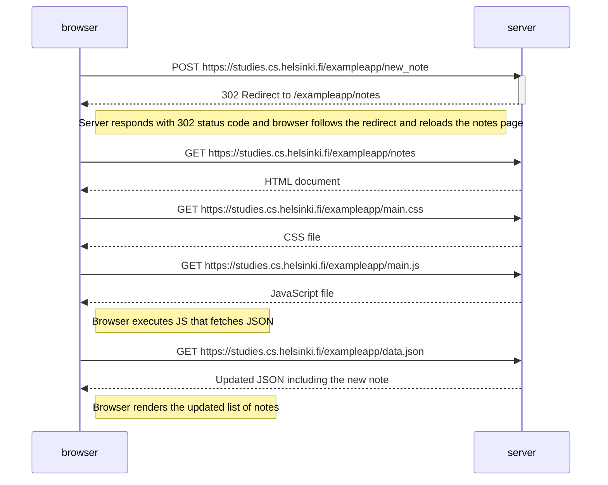

```mermaid
sequenceDiagram
    participant browser
    participant server

    browser->>server: POST https://studies.cs.helsinki.fi/exampleapp/new_note
    activate server
    server-->>browser: 302 Redirect to /exampleapp/notes
    deactivate server

    Note right of browser: Server responds with 302 status code and browser follows the redirect and reloads the notes page

    browser->>server: GET https://studies.cs.helsinki.fi/exampleapp/notes
    server-->>browser: HTML document

    browser->>server: GET https://studies.cs.helsinki.fi/exampleapp/main.css
    server-->>browser: CSS file

    browser->>server: GET https://studies.cs.helsinki.fi/exampleapp/main.js
    server-->>browser: JavaScript file

    Note right of browser: Browser executes JS that fetches JSON

    browser->>server: GET https://studies.cs.helsinki.fi/exampleapp/data.json
    server-->>browser: Updated JSON including the new note

    Note right of browser: Browser renders the updated list of notes
```
