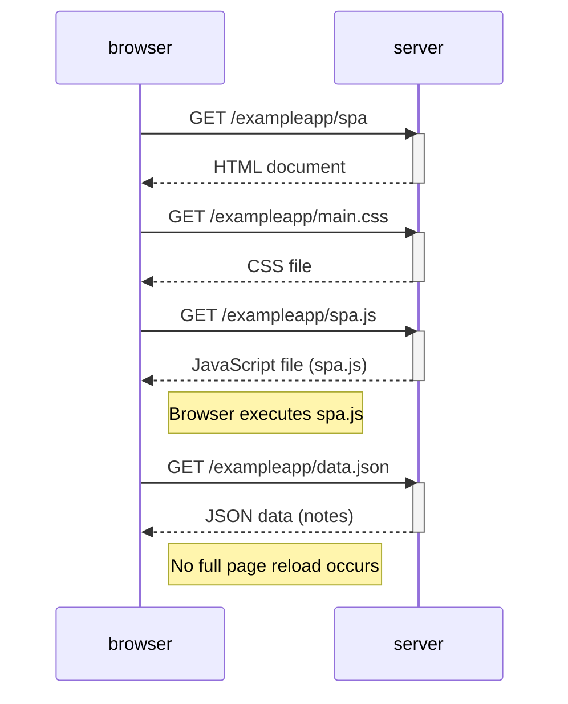

```mermaid
sequenceDiagram
    participant browser
    participant server

    browser->>server: GET /exampleapp/spa
    activate server
    server-->>browser: HTML document
    deactivate server

    browser->>server: GET /exampleapp/main.css
    activate server
    server-->>browser: CSS file
    deactivate server

    browser->>server: GET /exampleapp/spa.js
    activate server
    server-->>browser: JavaScript file (spa.js)
    deactivate server

    Note right of browser: Browser executes spa.js

    browser->>server: GET /exampleapp/data.json
    activate server
    server-->>browser: JSON data (notes)
    deactivate server

    Note right of browser: No full page reload occurs
```
