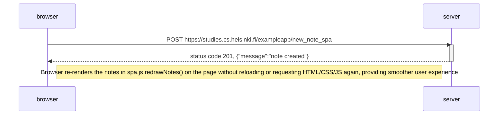

```mermaid
sequenceDiagram
    participant browser
    participant server

    browser->>server: POST https://studies.cs.helsinki.fi/exampleapp/new_note_spa
    activate server
    server-->>browser: status code 201, {"message":"note created"}
    deactivate server

    Note right of browser: Browser re-renders the notes in spa.js redrawNotes() on the page without reloading or requesting HTML/CSS/JS again, providing smoother user experience
```
